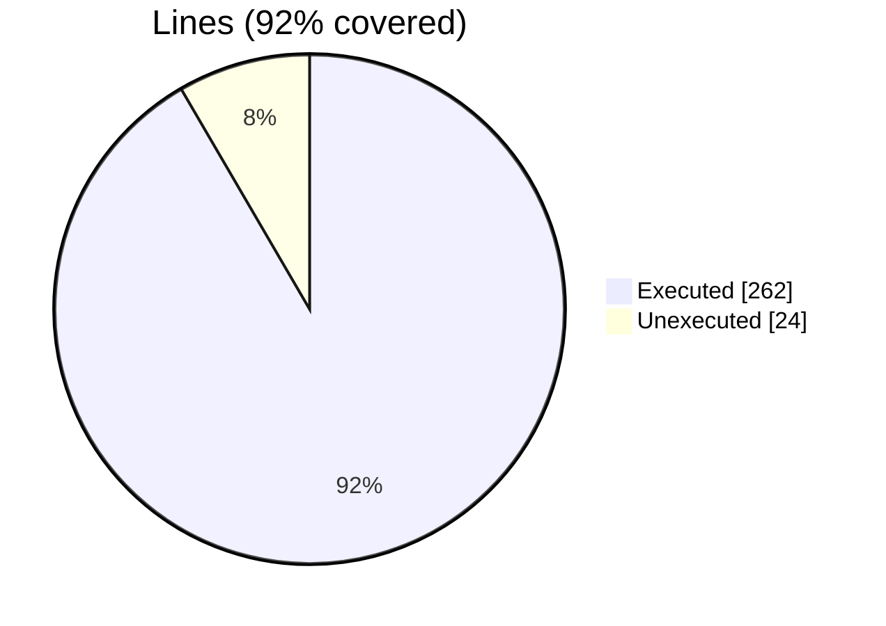
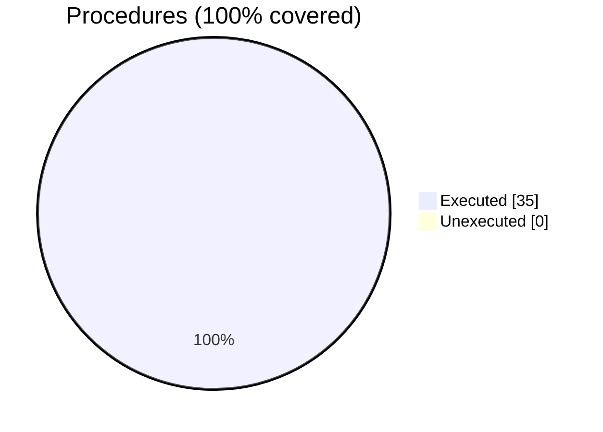

### Coverage analysis of *befor64.F90*

|Lines| | |
| --- | --- | --- |
|Executable lines            |286| |
|Executed lines              |262|92%|
|Unexecuted lines            |24|8%|
|Average hits / executed     |24.82442748091603| |

|Procedures| | |
| --- | --- | --- |
|Total procedures            |35| |
|Executed procedures         |35|100%|
|Unexecuted procedures       |0|0%|
|Average hits / executed     |4.514285714285714| |

#### Unexecuted procedures

 + *none*

#### Executed procedures

 + *subroutine* **encode_bits**: tested **36** times
 + *subroutine* **decode_bits**: tested **36** times
 + *subroutine* **b64_encode_R8**: tested **6** times
 + *subroutine* **b64_decode_up**: tested **4** times
 + *subroutine* **b64_decode_up_a**: tested **4** times
 + *subroutine* **b64_encode_R8_a**: tested **4** times
 + *subroutine* **b64_encode_R4_a**: tested **4** times
 + *subroutine* **b64_decode_R8**: tested **4** times
 + *subroutine* **b64_decode_I4**: tested **4** times
 + *subroutine* **b64_decode_R8_a**: tested **4** times
 + *subroutine* **b64_decode_I8_a**: tested **4** times
 + *subroutine* **b64_init**: tested **2** times
 + *subroutine* **b64_encode_up**: tested **2** times
 + *subroutine* **b64_encode_up_a**: tested **2** times
 + *subroutine* **b64_encode_R4**: tested **2** times
 + *subroutine* **b64_encode_I8**: tested **2** times
 + *subroutine* **b64_encode_I4**: tested **2** times
 + *subroutine* **b64_encode_I2**: tested **2** times
 + *subroutine* **b64_encode_I1**: tested **2** times
 + *subroutine* **b64_encode_string**: tested **2** times
 + *subroutine* **b64_encode_I8_a**: tested **2** times
 + *subroutine* **b64_encode_I4_a**: tested **2** times
 + *subroutine* **b64_encode_I2_a**: tested **2** times
 + *subroutine* **b64_encode_I1_a**: tested **2** times
 + *subroutine* **b64_encode_string_a**: tested **2** times
 + *subroutine* **b64_decode_R4**: tested **2** times
 + *subroutine* **b64_decode_I8**: tested **2** times
 + *subroutine* **b64_decode_I2**: tested **2** times
 + *subroutine* **b64_decode_I1**: tested **2** times
 + *subroutine* **b64_decode_string**: tested **2** times
 + *subroutine* **b64_decode_R4_a**: tested **2** times
 + *subroutine* **b64_decode_I4_a**: tested **2** times
 + *subroutine* **b64_decode_I2_a**: tested **2** times
 + *subroutine* **b64_decode_I1_a**: tested **2** times
 + *subroutine* **b64_decode_string_a**: tested **2** times

 --- 
 Report generated by [FoBiS.py](https://github.com/szaghi/FoBiS)