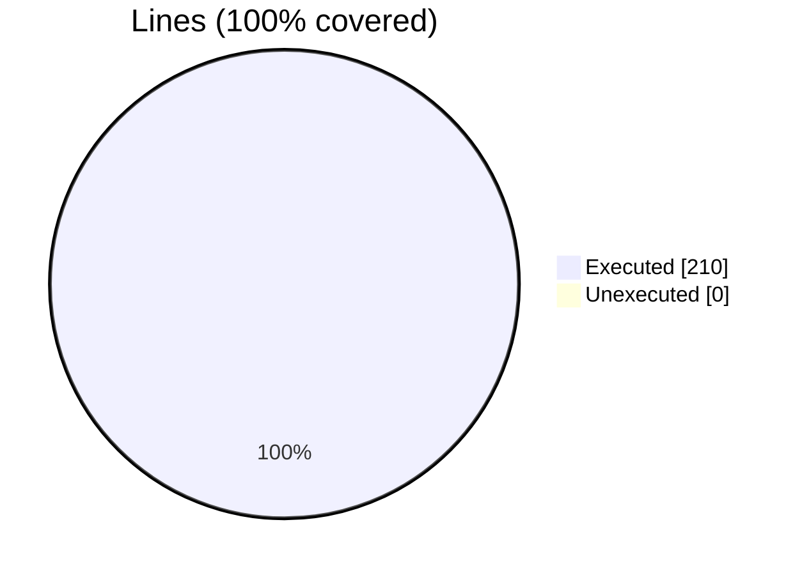
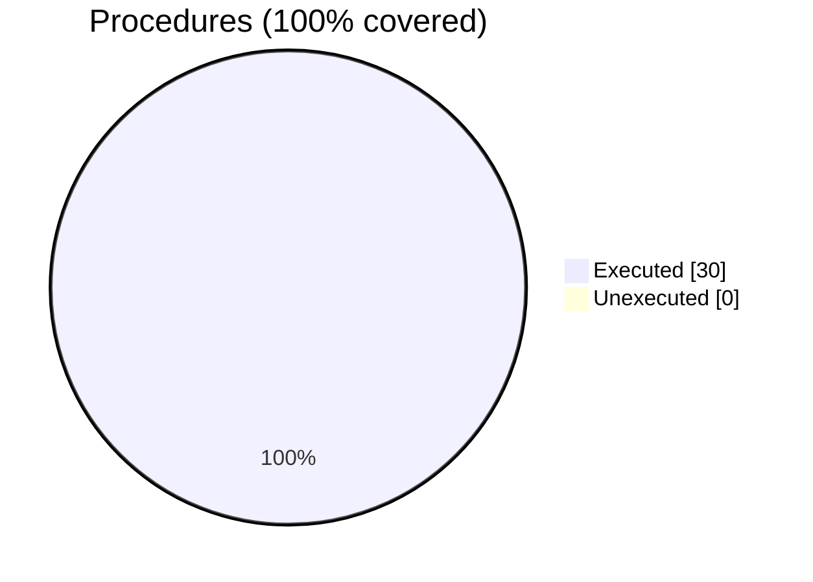

### Coverage analysis of *befor64_pack_data_m.F90*

|Lines| | |
| --- | --- | --- |
|Executable lines            |210| |
|Executed lines              |210|100%|
|Unexecuted lines            |0|0%|
|Average hits / executed     |13.123809523809523| |

|Procedures| | |
| --- | --- | --- |
|Total procedures            |30| |
|Executed procedures         |30|100%|
|Unexecuted procedures       |0|0%|
|Average hits / executed     |3.933333333333333| |

#### Unexecuted procedures

 + *none*

#### Executed procedures

 + *subroutine* **pack_data_R8_R4**: tested **4** times
 + *subroutine* **pack_data_R8_I8**: tested **4** times
 + *subroutine* **pack_data_R8_I4**: tested **4** times
 + *subroutine* **pack_data_R8_I2**: tested **4** times
 + *subroutine* **pack_data_R8_I1**: tested **4** times
 + *subroutine* **pack_data_R4_R8**: tested **4** times
 + *subroutine* **pack_data_R4_I8**: tested **4** times
 + *subroutine* **pack_data_R4_I4**: tested **4** times
 + *subroutine* **pack_data_R4_I2**: tested **4** times
 + *subroutine* **pack_data_R4_I1**: tested **4** times
 + *subroutine* **pack_data_I8_R8**: tested **4** times
 + *subroutine* **pack_data_I8_R4**: tested **4** times
 + *subroutine* **pack_data_I8_I4**: tested **4** times
 + *subroutine* **pack_data_I8_I2**: tested **4** times
 + *subroutine* **pack_data_I8_I1**: tested **4** times
 + *subroutine* **pack_data_I4_R8**: tested **4** times
 + *subroutine* **pack_data_I4_R4**: tested **4** times
 + *subroutine* **pack_data_I4_I8**: tested **4** times
 + *subroutine* **pack_data_I4_I2**: tested **4** times
 + *subroutine* **pack_data_I4_I1**: tested **4** times
 + *subroutine* **pack_data_I2_R8**: tested **4** times
 + *subroutine* **pack_data_I2_R4**: tested **4** times
 + *subroutine* **pack_data_I2_I8**: tested **4** times
 + *subroutine* **pack_data_I2_I4**: tested **4** times
 + *subroutine* **pack_data_I2_I1**: tested **4** times
 + *subroutine* **pack_data_I1_R8**: tested **4** times
 + *subroutine* **pack_data_I1_R4**: tested **4** times
 + *subroutine* **pack_data_I1_I8**: tested **4** times
 + *subroutine* **pack_data_I1_I4**: tested **4** times
 + *subroutine* **pack_data_I1_I2**: tested **2** times

 --- 
 Report generated by [FoBiS.py](https://github.com/szaghi/FoBiS)