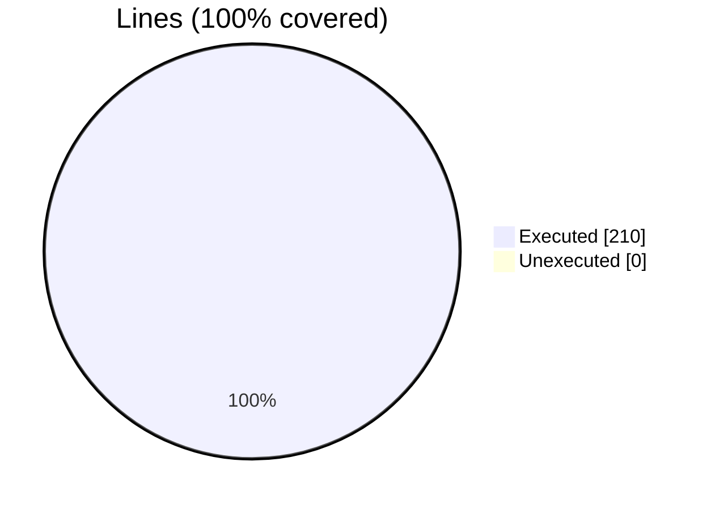
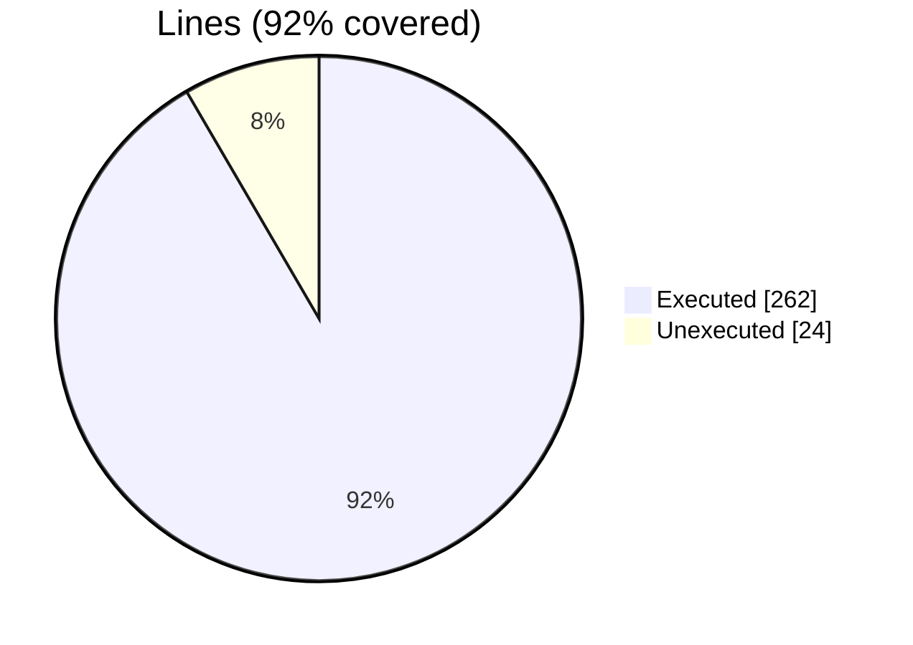
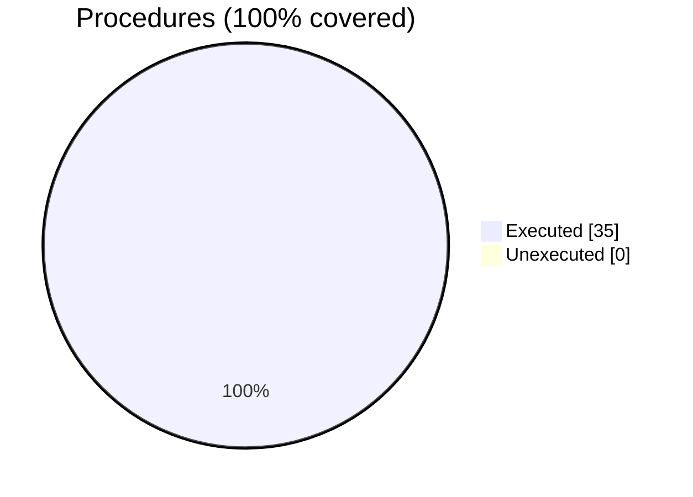

### coverage-analysis

#### [[befor64_pack_data_m.F90.gcov]]

|Lines| | |
| --- | --- | --- |
|Executable lines            |210| |
|Executed lines              |210|100%|
|Unexecuted lines            |0|0%|
|Average hits / executed     |13.123809523809523| |

|Procedures| | |
| --- | --- | --- |
|Total procedures            |30| |
|Executed procedures         |30|100%|
|Unexecuted procedures       |0|0%|
|Average hits / executed     |3.933333333333333| |

#### [[befor64.F90.gcov]]

|Lines| | |
| --- | --- | --- |
|Executable lines            |286| |
|Executed lines              |262|92%|
|Unexecuted lines            |24|8%|
|Average hits / executed     |24.82442748091603| |

|Procedures| | |
| --- | --- | --- |
|Total procedures            |35| |
|Executed procedures         |35|100%|
|Unexecuted procedures       |0|0%|
|Average hits / executed     |4.514285714285714| |

